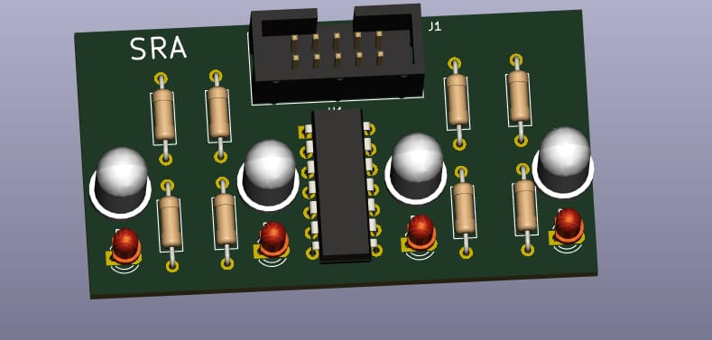
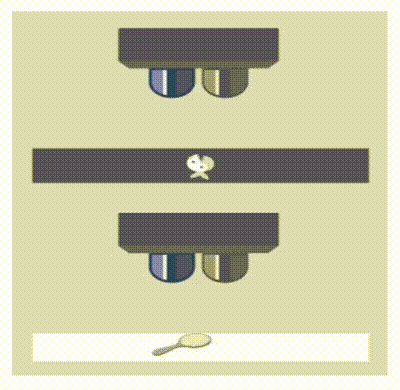

## LSA - Light Sensor Array

### Table of Contents
* [Overview](#overview)
* [Components of LSA](#components-of-lsa)
* [Function of Components](#function-of-components)
	* [LED](#function-of-components)
	* [PhotoDiode](#function-of-components)
	* [IC LM324](#function-of-components)
	* [Resistors](#function-of-components)
* [Working Principle](#working-principle)
* [Appplications](#applications)
* [Scope of Improvement](#scope-of-improvement)
* [Description of Functions Used](#description-of-functions-used)

### Overview 
- The Light Sensor Array(LSA) is used to detect the white/black lined surface and it sends this data to the microcontroller ESP32. Thus, the purpose of line following is achieved.

- Physical PCB


- PCB Model


### Components of LSA
| Component   | Description   | Quantity |
| ----------- | ------------- | -------- |
| LED         | Emits light   |  4       |
| PhotoDiode  | Absorbs light |  4       |
| IC LM324    | Op.Amp. IC    |  1       |  
| Resistors   | Limit Current |  8       |

### Function of Components
- LED
	- LSA consists of Four LED and PhotoDiode Pairs. The specific LED's emit white light which is incident on the surface and some of it is absorbed by the surface. The voltage source For the LEDs to glow is VCC.

- PhotoDiode
	- Based upon the reflectivity coefficient of the surface( generally less than 1), the remaining light reflected from the surface is captured by the Photodiodes. LEDs and complimentary photodiodes are used to efficiently detect the surface (white/black line) as the environment also contains unwanted light for the LSA sensor. The amount of light received is directly proportional to the current generated by it. More the light, more the current, more the reading.
 
- IC LM324 
	- This is a Quad(4) OP.Amp. IC. Op.Amp i.e Operation Amplifiers amplify the current with constant volatge. Since the current reading from photo diodes is significantly small and difficult to compare, it needs to be amplified. The 4 amplified outputs serve as raw readings of LSA.

- Resistors
	- Now to limit the current and thus to protect the LEDs, PhotoDiodes current limiting resistors are used.

### Working Principle
- LSA works on the principle of reflectivity of light for different types of surfaces.
	- Black Surface -> HIGH absorptivity -> LESS reflectivity
	- White Surface -> LOW absorptivity -> HIGH reflectivity
- Demonstration
 

### Applications 
- Application of LSA majorly lies in line following.

### Scope of Improvement
- LSA sometimes provides slightly inaccurate readings due to external light and conditions. Therefore, LSA has low accuracy. Hence LSA should be kept close to the ground.
- As of now only white and black surfaces are being mapped. Given accurate sensors and proper mapping we can map LSA for any range of RGB colours.

### Description of Functions Used
* ```c
    esp_err_t enable_line_sensor(int mode)	
    ```
    **Description** : Enables and Configures the adc(Analog to Digital Converter).	.

    **Parameters** :
    * `None` 

    **Returns** : esp_err_t returns ESP_OK if adc is initialised properly, else it returns ESP_ERR_INVALID_ARG
    
* ```c
    float bound(float val, float min, float max)	
    ```
    **Description** : Bounds the given val within the range [min, max].

    **Parameters** :
    * `val` : the value which needs to be bounded in the range [min, max].
    * `min` : the minimium limit value of the bounding range.
    * `max` : the maximum limit value of the bounding range.

    **Returns** : the bounded value of val within the bounding range.
    
* ```c
    float map(float val, float input_lower_limit, float input_higher_limit, float output_lower_limit, float output_higher_limit)	
    ```
    **Description** : Maps the range [input_lower_limit, input_higher_limit] to  the range [output_lower_limit, output_higher_limit].

    **Parameters** :
    * `val` : the value which needs to be mapped.
    * `input_lower_limit` : the minimium limit value of the input mapping range.
    * `input_lower_limit` : the maximum limit value of the input mapping range.
    * `output_lower_limit` : the minimium limit value of the output mapping range.
    * `output_lower_limit` : the maximum limit value of the output mapping range.
    
    **Returns** : the mapped value of val lying within the output mapping range.
    
* ```c 
    void vTaskDelay(const TickType_t xTicksToDelay)
  ```

  **Description** : Delay a task for a given number of ticks.The constant portTICK_PERIOD_MS can be used to calculate real time from the tick rate - with the     resolution of one tick period.

  **Parameters** : 
  * `xTicksToDelay` : The amount of time, in tick periods, that the calling task should block.
    
