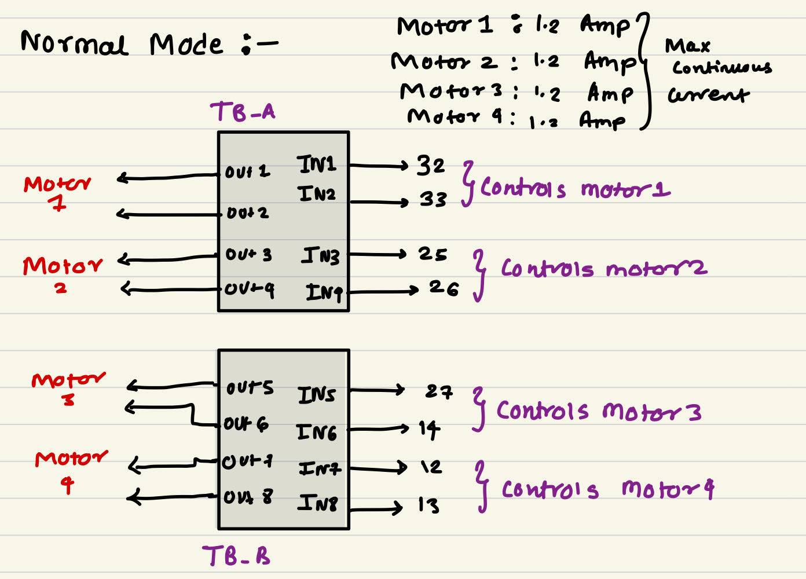

# switch_controlled_motor_normal
## About the Project
- ### **Motor Driver Modes**
    - The SRA board has 2x TB6612FNG motor drivers which allow a maximum of 4 motors to be controlled. This motor driver is characterized by its operation in two modes - **Normal mode** and **Parallel mode**, **switch_controlled_motor_normal** deals with normal mode approach:   
        1. **Normal Mode**
         
        

        
        

        -  As discussed earlier, the new design has two motor drivers. Each TB6612FNG can control two motors. Therefore, using two motor driver one can control 4 motors using 8 GPIO's of ESP32.
        - E.g.: If pin 32 is HIGH(IN1 = HIGH) and pin 33 is low(IN2 = LOW) then motor 1 moves in the forward direction. 
        - So in normal mode, 4 motors can be connected to the board, with a per channel/motor current capacity of 1.2A.
          

- ### **Working**
    - takes input from LSA  
    - runs the bot motors in Normal mode according to the input.

