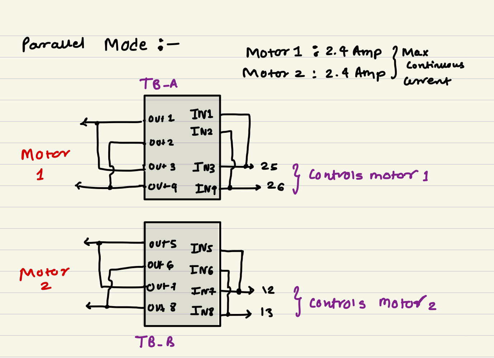

# Switch Controlled Motor Driver in Parallel Mode
- ### **Motor Driver Modes**
    - The new edition has 2x TB6612FNG motor drivers which allow a maximum of 4 motors to be controlled. This motor driver is characterized by its operation in two modes - **Normal mode** and **Parallel mode**:   
   
        1. **Parallel Mode**
         
        

        
        

        -  The parallel mode is a special feature, used for high-rated motors, requiring more than the 1.2A current limit.
        -  In this mode, the channel's directional pins and output pins are shorted; only one motor is connected to a motor driver i.e. two channels, giving a current capacity of 2.4A. Thus, two high rated motors can be controlled using ESP32.
        -  Note: The directional pin shorting is done by a manual DPDT switch. If the user turns on TB_A switch then the first motor driver goes into the parallel mode and its directional pins are shorted, where GPIO connections are IN1 = IN3 = 25 and IN2 = IN4 = 26. If TB_A switch is off, then the first motor driver goes into normal mode where IN1 = 32: IN2 = 33: IN3 = 25: IN4 = 26. This is all done automatically. Also for parallel mode, the J1, J2, J3 and J4 junctions need to be shorted.
          
