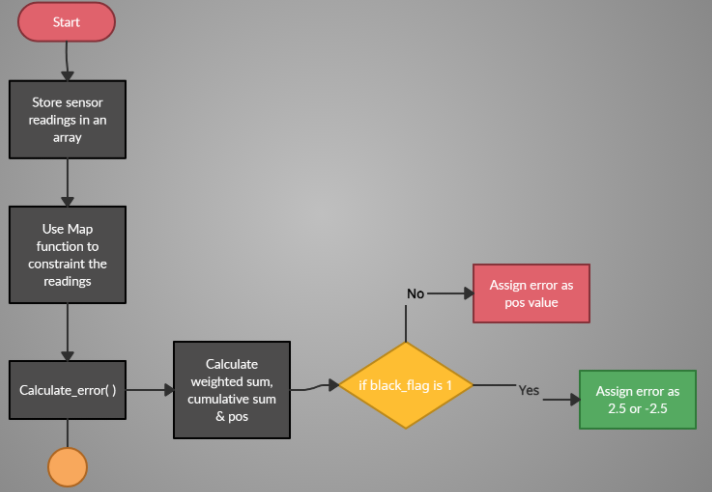
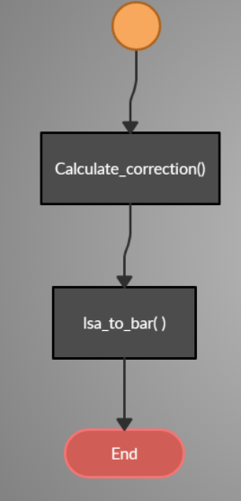

# LINE FOLLOWING

## TABLE OF CONTENTS

* [Directory Structure](#Directory-Structure)
* [How does a bot follow the line?](#How-bot-balance-itself?)
    * [Theory](#theory)
    * [Use of PID](#Use-of-pid)
    * [Use of Wifi Module](#)
* [Formula for Error Calculation](#formula-for-calculation-of-pitch-correction)
* [Algorithm](#algorithm)
* [Description of the Functions](#Description-of-the-functions)

## Directory Sturcture

## How does bot balance itself?

### Theory
Line Following is one of the most important aspects of robotics.
A Line Following Robot is an autonomous robot which is able to follow a line (usually black or white) that is drawn on a surface consisting of a contrasting color. It is designed to move automatically and follow the line. In our case, the robot will follow a white line drawn on a black surface.
The robot uses arrays of optical sensors (LSAs) to identify the line, thus assisting the robot to stay on the track. We have used an array of four sensors to make the movement precise and flexible.

### Use of PID

PID stands for **P**roportional-**I**ntegral-**D**erivative

## Error Calculation

## ALGORITHM
The process to implement a line following robot can be summarized in these basic steps :
Sensors detect deviation from line
1. Find error
2. Find error correction
3. Correct the error
4. Follow the line

## Description of the functions

