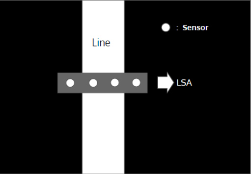
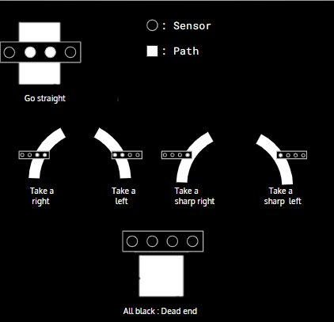
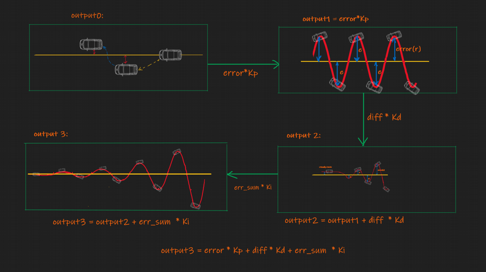
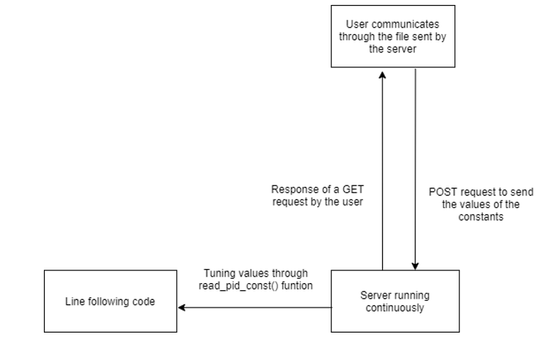
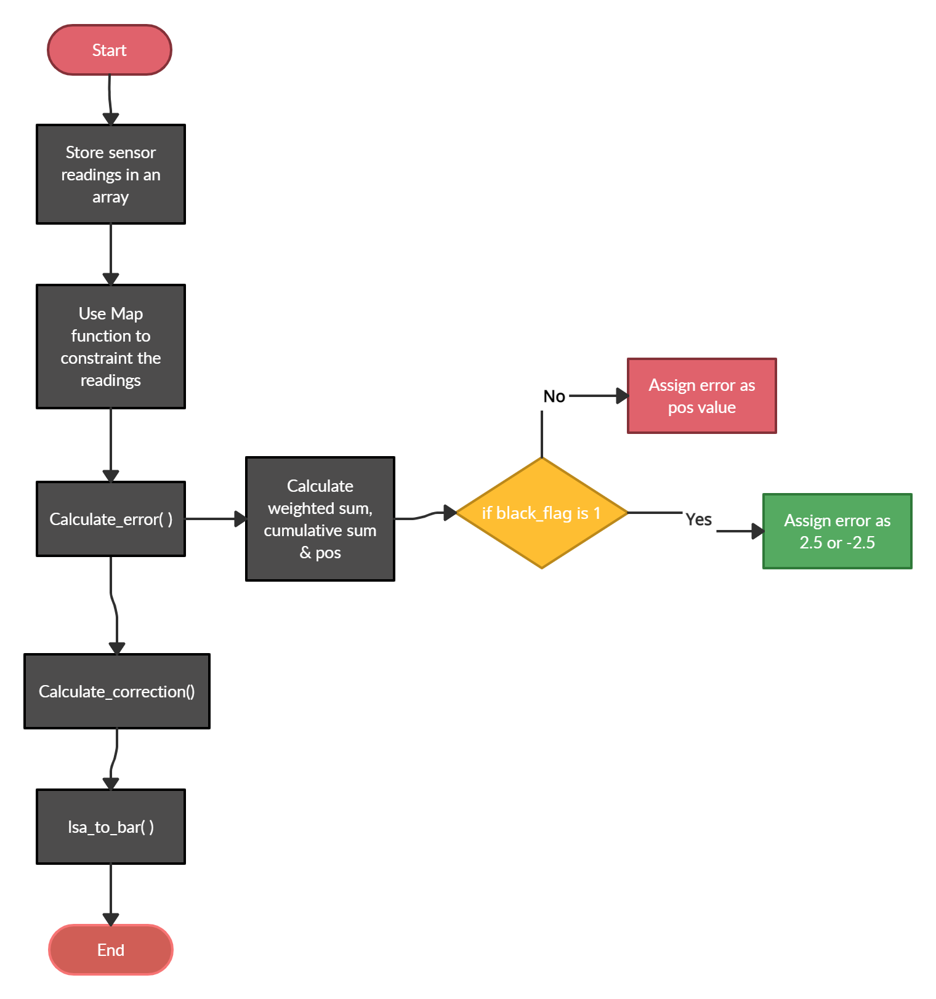

# LINE FOLLOWING

## TABLE OF CONTENTS


* [Directory Structure](#Directory-Structure)
* [Theory](#theory)
* [How does a bot follow the line?](#How-does-a-bot-follow-the-line?)
    * [Error Calculation](#Error-Calculation)
    * [Use of PID](#Use-of-pid)
    * [Use of Wifi Module](#Use-of-Wifi-Module)
* [Algorithm](#algorithm)
* [Description of the Functions](#Description-of-the-functions)


## Directory Structure
```
.
├── CMakeLists.txt
├── frontend
│   └── index.html
├── main
│   ├── CMakeLists.txt
│   ├── component.mk
│   ├── include
│   │   ├── tuning_http_server.h
│   │   └── wifi_handler.h
│   ├── Kconfig
│   ├── line_following.c
│   ├── tuning_http_server.c
│   └── wifi_handler.c
└── partition_table.csv
```
## Theory
Line Following is one of the most important aspects of robotics.
A Line Following Robot is an autonomous robot which is able to follow a line (usually black or white) that is drawn on a surface consisting of a contrasting color. It is designed to move automatically and follow the line.

> In our case, the robot will follow a white line drawn on a black surface.

## How does a bot follow the line?
The robot uses arrays of optical sensors (LSAs) to identify the line, thus assisting the robot to stay on the track. We have used an array of four sensors to make the movement precise and flexible.

<!--  -->


### Error Calculation
* First, we multiply the values of the LSA with certain weights. Here we have used 3,1,-1, and -3
* 3 for the leftmost sensor, -3 for the rightmost
* The more negative the resulting weighted sum, the more the robot is to the left of the line, and vice versa.

<!--  -->


### Use of PID

PID stands for **P**roportional-**I**ntegral-**D**erivative
It is one kind of device used to control different process variables like pressure, flow, temperature, and speed in industrial applications. In this controller, a control loop feedback device is used to regulate all the process variables.This type of control is used to drive a system in the direction of an objective location otherwise level.
> * [Follw this link for detailed explanation of PID](https://www.youtube.com/playlist?list=PLn8PRpmsu08pQBgjxYFXSsODEF3Jqmm-y)
> * [this link explains PID with respect to line folllowing](https://youtu.be/4Y7zG48uHRo)
<!--  -->


### Use of Wifi Module
Although simple in concept, the mathematics underpinning PID control is complex and acheiving optimal performance entails selecting process-specific values for a range of interacting parameters.
The process of finding these values is referred to as “tuning.” When a PID controller is tuned optimally, the device minimizes deviation from the set point, and responds to disturbances or set point changes quickly but with minimal overshoot.

For easy tuning we use wifi module that dynamically changes the `kp,ki,kd` values
> 1. User connects to the server using Wi-Fi
> 2. Server sends the HTML file back to the user
> 3. Server receives the kp,ki,kd values for tuning
> 4. Server makes appropriate changes to the bot
> 5. Back to step 3
<!--  -->


## ALGORITHM
The process to implement a line following robot can be summarized in these basic steps :
Sensors detect deviation from line
> 1. Find error
> 2. Find error correction
> 3. Correct the error
> 4. Follow the line
<!--  -->


## Description of the functions
```c
void calculate_error()
```
**Description**: Uses sensor readings to calculate the error.
> error is calculated by multiplying weights to the sensor reading and taking a weighted sum.
> wieghted sum is divided by sum to calculate position wrt to line
> if all sensors were black, reached a dead end, we decide the direction according to previous error and assign error of 2.5
```c
void calculate_correction()
```
**Description**: Uses error calculated by the error function to calculate the correction. 
> ```c    correction = read_pid_const().kp*error + read_pid_const().ki*cumulative_error + read_pid_const().kd*difference ```
