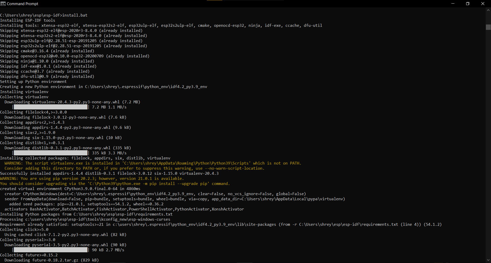
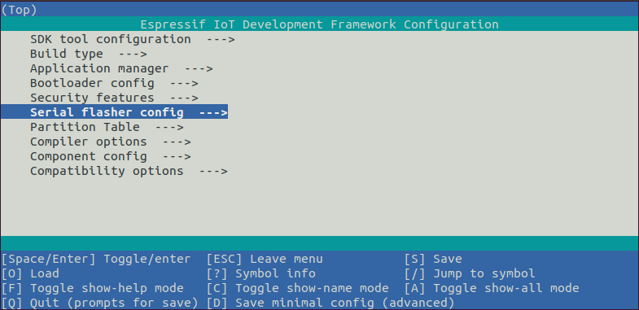

# Table Of Contents
* WALL-E Installation
    * [For Windows](#for-windows)
    * [For Linux](#for-linux)
    * [For MacOS](#for-macos)

# For Windows
The first step is to install the ESP-IDF. 

## Step 1:Download the installer from [here]( https://docs.espressif.com/projects/esp-idf/en/latest/esp32/get-started/windows-setup.html#esp-idf-tools-installer )
### Please download the offline version
<p align="center">
  
</p>

### Step 2: After Downloading open .exe file, select `I accept the agreement` then click `Next >`
<p align="center">
  
</p>

### Step 3: If you don't have python 3.6 installed , then select `Python 3.6 (64-bit)`  
<p align="center">
  
</p>

### Step 4: If you already have git installed, select `2.30.0.Windows.2`, or else select `Install Git`   
<p align="center">
  
</p>

### Step 5: Next, click `v4.2(release version)` 

* Note : The installation path should be `%userprofile%\esp\esp-idf` 
* To put it simply it should be C:\Users\Username\esp\esp-idf

<p align="center">
  
</p>

### Step 6: Click on `Install` then after Installation,check all boxes and click on `Finish`
<p align="center">
  
  
  
</p>


 ### Step 7: Run `install.bat` and then `export.bat` in ESP-IDF Command Prompt:
 ```
 cd %userprofile%\esp\esp-idf
 install.bat
 export.bat
 ```
<p align="center">
  
  
</p>

### Step 8: Cloning the Wall-E Git Repo
To clone the Repo just execute the following command on ESP-IDF Command Prompt. We are Making the project folder in the esp folder
```sh
cd %userprofile%\esp
git clone https://github.com/SRA-VJTI/Wall-E_v2.2.git --recurse-submodules
cd Wall-E_v2.2

```
## For Linux 

### Step 1 : Cloning the Wall-E Git repo
To clone the repo,execute the following commands on terminal. Installing the project in the Home folder.
```sh
cd $HOME
git clone https://github.com/SRA-VJTI/Wall-E_v2.2.git --recurse-submodules
cd Wall-E_v2.2
```
### Step 2 : Installing the necessary prerequisites.
Run the following commands for a quick install on Linux-based systems:
```sh
cd $HOME/Wall-E_v2.2
sudo chmod +x wall_e_install.sh
./wall_e_install.sh
```
- Test the hello_world example in the same terminal; if it runs without any errors, log out & log back in.
(Connect ESP32 to your device before running the below commands)
```sh
cd ~/esp/esp-idf/examples/get-started/hello_world
idf.py flash monitor
```

## For MacOS
### STEP 1 : Installing the necessary files
- Download the file "wall_e_install_mac.sh" given in the root folder itself and put it in the "Downloads" folder
- Download the driver by clicking on this [link](https://www.silabs.com/documents/public/software/Mac_OSX_VCP_Driver.zip) , unzip it, then install it on the system

### STEP 2 : Opening The Terminal
Open the terminal by pressing command+space and then typing terminal.

### STEP 3 : Installing the Pre-Requisites 
Copy this command in the command in the terminal , then press return 
```sh
 source ~/Downloads/wall_e_install_mac.sh
```
Note:- when you are asked to type the password in the terminal, password will not be visible to you. Just type the password and then press return.

- Test the hello_world example in the same terminal; if it runs without any errors, log out & log back in.
(Connect ESP32 to your device before running the below commands)
```sh
cd ~/esp/esp-idf/examples/get-started/hello_world
idf.py flash monitor
```
 
### STEP 4 : Cloning Wall-E git repo
Cloning the Wall-E Git repo
To clone the repo,execute the following commands on terminal.
```sh
cd $HOME
git clone https://github.com/SRA-VJTI/Wall-E_v2.2.git --recurse-submodules
cd Wall-E_v2.2
```

 It will take some time to install, make sure you have an active internet connection. It will take around 2GB of data.

# Commands
This is the basic procedure for compiling and flashing a code on the ESP32

### Step 1 : Set Up Environtment variables
In the terminal where you are going to use ESP-IDF, run:
- For Linux/MacOS  
   - Run `get_idf` command.
   - If `get_idf` command shows an error, use `. $HOME/esp/esp-idf/export.sh` command.
- For Windows
   - Run `%userprofile%\esp\esp-idf\export.bat` command.

Through this command specify the Folder/Project in which we will to be using ESP-IDF 

### Step 2 : Start a Project
Now you are ready to prepare your application for ESP32.
* For Linux/MacOS -
```sh
cd ~/esp
cp -r $IDF_PATH/examples/get-started/hello_world .
```
* For Windows -
```sh
cd %userprofile%\esp
xcopy /e /i %IDF_PATH%\examples\get-started\hello_world hello_world
```
### Step 3 : Connect Your Device
Connect your ESP32 board to the computer and check under what serial port the board is visible.
* Linux : `/dev/tty`
* MacOS : `/dev/cu`
* Windows : `COM1`

### Step 4 : Configure

* For Linux/MacOS -
```sh
cd ~/esp/hello_world #Navigating to the file
idf.py set-target esp32 #Command for Setting the Target 
idf.py menuconfig # Command for Opening the Configuration Menu
```
* For Windows -
```sh
cd %userprofile%\esp\hello_world #Navigating to the file
idf.py set-target esp32 #Command for Setting the Target
idf.py menuconfig #Command for Opening the Configuration
```
If the previous steps have been executed correctly, you screen will show this:
<p align="center">
  
</p>

### Step 5 : Build the Project
Build the project by running:
* Same for Both Linux and Windows
```sh
idf.py build #Command for building the code
```
This command will compile the application and all ESP-IDF components, then it will generate the bootloader, partition table, and application binaries.
<p align="center">
  
</p>

### Step 6 : Flash onto the Device
Flash the binaries that you just built (bootloader.bin, partition-table.bin and hello-world.bin) onto your ESP32 board by running.:
```sh
idf.py -p PORT [-b BAUD] flash 
```
* For Linux 
   * PORT - /dev/ttyUSB0 (`idf.py -p /dev/ttyUSB0 -b 2000000 flash`)
* For MacOS
   * PORT - /dev/cu.usbserial-0001(`idf.py -p /dev/cu.usbserial-0001 -b 2000000 flash`) 
* For Windows 
   * PORT - /COM1 (`idf.py -p /COM1 -b 2000000 flash`)
* Depending on the port you used for connecting the board the port can vary from /dev/ttyUSB0 and Zero can be replaced by any other consecutive number
and for windows /COM1 one can be replaced by other number depending on the port to which you have connected esp.
* Note : In case you are unable to flash Press Down the Boot Button on ESP32 and then execute the Flash command

### Step 7 : Flash onto the Device
* For seeing the output given by esp32 we use this command after flashing
```sh
idf.py flash monitor
```


