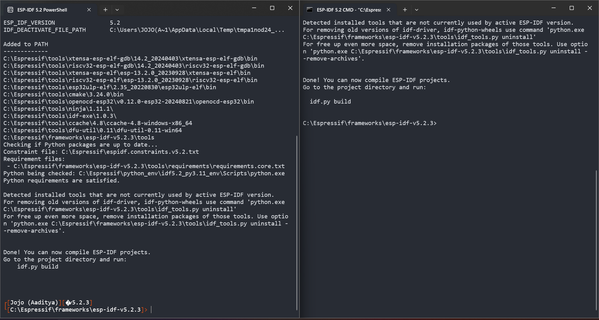
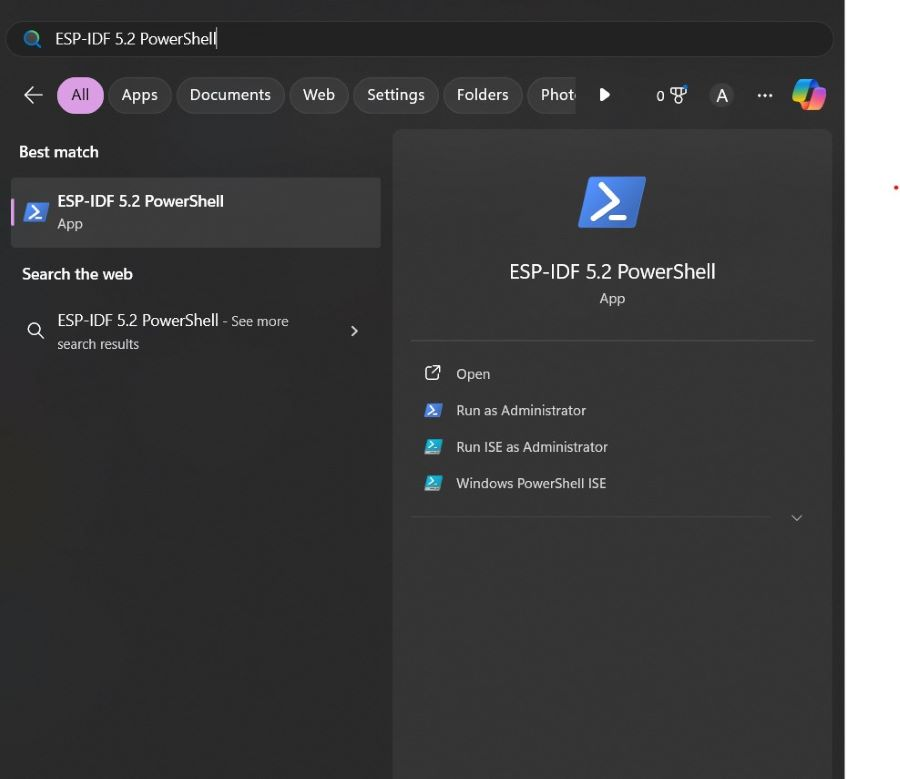
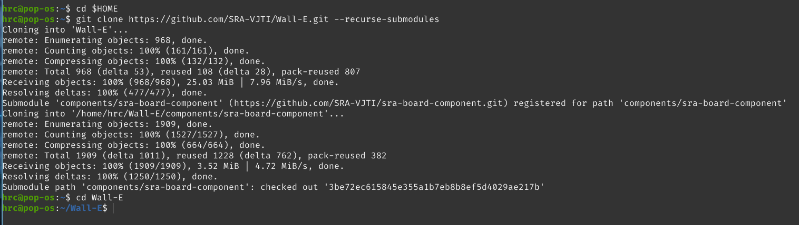
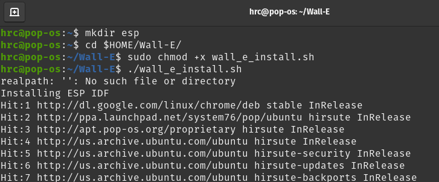

# Table Of Contents
* WALL-E Installation
    * [For Windows](#for-windows)
    * [For Linux](#for-linux)
    * [For MacOS](#for-macos)

# For Windows
The first step is to install the ESP-IDF v5.2. 

## Step 1:Download the installer from [here](https://dl.espressif.com/dl/esp-idf/?idf=5.2)
Please download the **offline** version pointed by the
arrow
<p align="center">
  
</p>

### Step 2: After Downloading open .exe file, select `I accept the agreement` then click `Next >`
<p align="center">
  
</p>

Once you reach this step, click next.

<p align="center">
  
</p>

We recommend to keep the default installation path and click next. 

<p align="center">
  
</p>

### Step 3: In Select Components section, keep everything as default and click next

<p align="center">
  
</p>

### Step 4: In Ready to Install section, click on install which will take a few minutes. And then later Click next

<p align="center">
  
</p>

### Step 5: Make sure all the checkbox are marked before clicking finish 

<p align="center">
  
</p>

### Step 6: Once you click On Finish, this is what you should be getting.

<p align="center">
    
</p>

### Step 7: Open ESP-IDF 5.2 PowerShell which should be on your desktop

<p align="center">
  
</p>

### Step 8: Cloning the Wall-E Git Repo
To clone the Repo just execute the following command on ESP-IDF Command Prompt. We are making the project folder in our home directory. 

```powershell
cd ~
mkdir Projects
cd Projects
git clone https://github.com/SRA-VJTI/Wall-E --recursive --depth 1
cd Wall-E
```

<p align="center">
  
</p>

**Pro Tip**: 
`cd ~/Projects/Wall-E` takes you to the Wall-E directory which contains all the required code 

## For Linux 

### Step 1: Getting the Installation script from the Wall-E repository
Open the terminal and check if you have the `curl` command installed on your machine. If not use your package manager to do so.
```sh
which curl
```
```sh
# For Debian / Ubuntu based distributions
sudo apt install curl

# For Red Hat Enterprise Linux / Fedora based distributions
sudo dnf install curl

# For Arch based distributions
sudo pacman -S curl
```
After having installed curl, use it to download the installation script to a convenient location in your system and execute it.
```sh
cd $HOME
curl https://raw.githubusercontent.com/SRA-VJTI/Wall-E/refs/heads/master/wall_e_install.sh -o $HOME/wall_e_install.sh
```
<p align="center">
  
</p>

### Step 2: Execute the Installation script
Execute the following commands for a quick install on Linux systems. This will install the required toolkit from Espressif and clone the Wall-E repository as well.
```sh
chmod +x $HOME/wall_e_install.sh
./wall_e_install.sh && source $HOME/."${SHELL#${SHELL%/*}/}"rc
```
<p align="center">
  
</p>


## For MacOS
### STEP 1 : Opening The Terminal
Open the terminal by pressing command+space and then typing terminal.

**Note:** If you're an M1 mac os user refer this [link](https://youtu.be/9W8rTTE1WEA) to open the terminal.

### STEP 2 : Installing the necessary file
- Download the installation script by executing the following command in the terminal.
```sh
curl https://raw.githubusercontent.com/SRA-VJTI/Wall-E/refs/heads/master/wall_e_install.sh -o wall_e_install.sh
sudo chmod +x wall_e_install.sh
./wall_e_install.sh
```
Note:- when you are asked to type the password in the terminal, password will not be visible to you. Just type the password and then press return.

- Test the hello_world example in the same terminal; if it runs without any errors, log out & log back in.
(Connect ESP32 to your device before running the below commands)
```sh
cd ~/esp/esp-idf/examples/get-started/hello_world
idf.py flash monitor
```
 
### STEP 4 : Going to the cloned Wall-E repository
The installation script also ensures that the Wall-E repository is cloned to your home directory. So to actually start building the examples present in the Wall-E repository, just change directory over to there and you can start building and flashing. 
```sh
cd $HOME
cd Wall-E
```

# Commands
This is the basic procedure for compiling and flashing a code on the ESP32


### Step 1 : Start a Project
Now you are ready to prepare your application for ESP32.
* For Linux/MacOS -
  
```sh
get_idf # To use esp-idf commands 
```
<p align="center">
  
</p>

```sh
cd ~/esp
cp -r ~/esp/esp-idf/examples/get-started/hello_world .
ls 
```
<p align="center">
  
</p>

* For Windows -
```powershell
cd ~/Projects/Wall-E/1_led_blink
``` 

### Step 2 : Connect Your Device
Connect your ESP32 board to the computer and check under what serial port the board is visible.
* Linux : `/dev/tty`
* MacOS : `/dev/cu`
* Windows : `eg: COM1`
  * After **connecting** the sra board, to check The port for Windows, Go to device manager (search it in the taskbar) It should look like this
  
<p align="center">
  
</p> 

The USB to UART bridge will be automatically detected after a few seconds of plugging it to your machine.

* If you don't see Ports (COM & LPT) after connecting USB: 
  * Click [here](https://support-bradyid.force.com/s/article/Ports-COM-LPT-Not-Showing-in-Device-Manager) and follow the steps

### Step 3 : Configure

* For Linux/MacOS -
```sh
cd ~/esp/esp-idf/examples/get-started/hello_world #Navigating to the file
idf.py set-target esp32 #Command for Setting the Target 
idf.py menuconfig # Command for Opening the Configuration Menu
```
* For Windows -
```powershell
idf.py set-target esp32 #Command for Setting the Target
idf.py menuconfig #Command for Opening the Configuration
```
If the previous steps have been executed correctly, you screen will show this:
<p align="center">
  
</p>

### Step 4 : Build the Project
Build the project by running:
* Same for Both Linux and Windows
```sh
idf.py build #Command for building the code
```
This command will compile the application and all ESP-IDF components, then it will generate the bootloader, partition table, and application binaries.
<p align="center">
  
</p>

### Step 5 : Flash onto the Device
Flash the binaries that you just built (bootloader.bin, partition-table.bin and hello-world.bin) onto your ESP32 board by running.:
```sh
idf.py -p PORT flash 
```
* For Linux 
   * PORT - /dev/ttyUSB0 (`idf.py -p /dev/ttyUSB0 flash`)
* For MacOS
   * PORT - /dev/cu.usbserial-0001(`idf.py -p /dev/cu.usbserial-0001 flash`) 
* For Windows 
   * PORT - COM1 (`idf.py -p COM1 flash`)
* Depending on the port you used for connecting the board the port can vary from /dev/ttyUSB0 and **Zero** can be replaced by any other consecutive number
and for **windows** COM1 can be replaced by other number depending on the port to which you have connected esp.
* Note : In case you are unable to flash Press Down the Boot Button on ESP32 and then execute the Flash command
  

### Step 6 : Flash onto the Device
* For seeing the output given by esp32 we use this command after flashing
```sh
idf.py flash monitor
```
