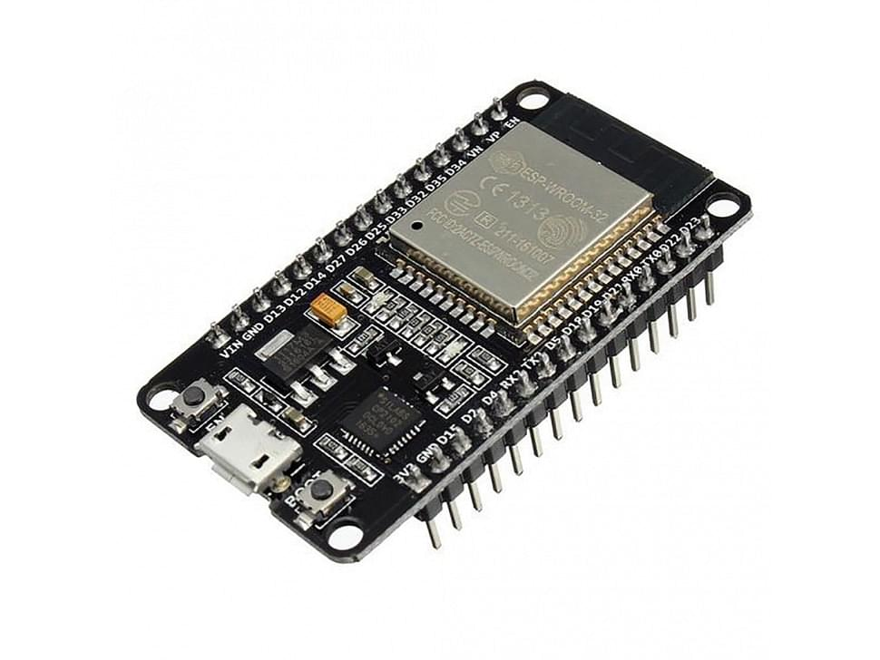

# Wall-E Workshop 2021
Wall-E Workshop is a privilege Workshop conducted by SRA, for the development of a self-balancing-line-following bot, implemented with esp32

  
  
  <h3 align="center"> Wall-E bot 2021</h3>
 

## Table of Contents
- [Wall-E Workshop](#wall-e-workshop)
  - [Getting Started with esp32](#getting-started-with-esp-32)
  - [LED Blink](#led-blikn)
  - [Light Sensing Array](#light-sensing-array)
  - [MPU6050](#mpu6050)
  - [Switch Controlled Motor in Normal Mode](#switch-controlled-motor-in-normal-mode)
  - [Switch Controlled Motor in Parallel Mode](#switch-controlled-motor-in-parallel-mode)
  - [Pulse Width Modulation](#pulse-width-modulation)
  - [Line-Following ](#line-following)
  - [Self-Balancing](#self-balancing)
  
## About the Workshop
- The main motive of the workshop is to introduce students with esp32 microcontroller, self-balancing and line following programs and the dynamics that work behind it.
- Hands on experience along with Hardware and Simulation.
- Capable of operating in an ultra-low-power mode, ideal for battery-powered applications.

 ## Getting Started esp32

  

- ESP32 is a series of low-power system on a chip microcontrollers with integrated Wi-Fi and dual-mode Bluetooth.
- Controls and communicates with micro level devices. 

 ## Content
| TOPIC |  Link  | Description |
|:----:|:-------:| :-----: |
|LED Blink| [LED_Blink](https://github.com/SRA-VJTI/Wall-E_v2.2-beta/blob/dev/1_led_blink/README.md) | Performing LED Blink by connecting the LED with esp32 |
|Light Sensing Array| [LSA](https://github.com/SRA-VJTI/Wall-E_v2.2-beta/blob/dev/2_LSA/README.md) | Sensing Array that uses different Light Sensors, majorly used for Line-Following |
|MPU6050 | [MPU](https://github.com/SRA-VJTI/Wall-E_v2.2-beta/blob/dev/3_MPU/README.md) | Motion Controlled MPU measures angles with respect to 6 Degrees of Freedom |
|Switch Controlled Motor in Normal Mode|[Normal_Mode](https://github.com/SRA-VJTI/Wall-E_v2.2-beta/blob/dev/4_switch_controlled_motor_normal/readme.md)| Controls the movement of Bot manually using Switches connected in Normal Mode|
|Switch Controlled Motor in Paralle Mode|[Parallel_Mode](https://github.com/SRA-VJTI/Wall-E_v2.2-beta/blob/dev/5_switch_controlled_motor_parallel/README.md)| Controls the movement of Bot manually using Switches connected in Parallel Mode|
|Pulse Width Modulation|[PWM](https://github.com/SRA-VJTI/Wall-E_v2.2-beta/blob/dev/6_PWM/README.md)| Calculate average Voltage and controls speed accordingly|
|Line-Following|[Line_Following]| Line-Following Algorithm that enables the bot to follow the path of white line|
|Self-Balancing|[Self_Balancing](https://github.com/SRA-VJTI/Wall-E_v2.2-beta/blob/dev/8_self_balancing/README.md)|Self-Balancing Algorithm that enables the bot to balance its weight under the force of gravity|
 
 
