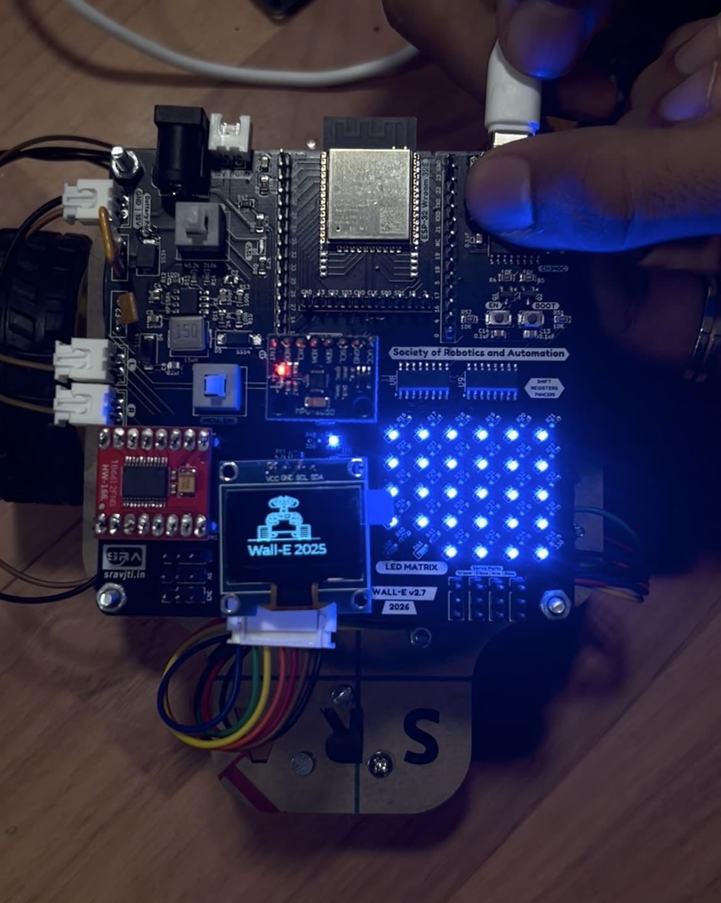
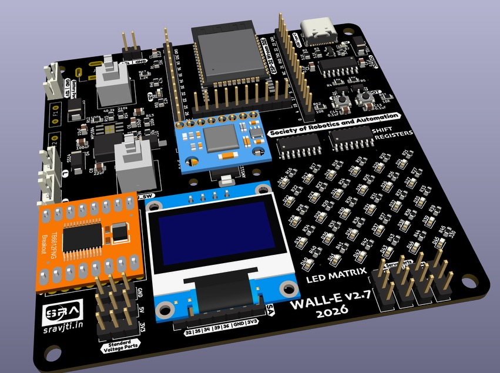

<p align="center">
  
  
  <h3 align="center"> Wall-E version 2.7 </h3>
  <p align="center">
    Code repository for <a href="https://github.com/SRA-VJTI/Wall-E">Wall-E_v2.7</a>
    <br />
    <br />
    <a href="https://github.com/SRA-VJTI/Wall-E/issues">Report Bug</a>
    ·
    <a href="https://github.com/SRA-VJTI/Wall-E/issues">Request Feature</a>
    ·
    <a href="https://github.com/SRA-VJTI/Wall-E/pulls">Send a Pull Request</a>
  </p>
 </p>
 
 <p align="center">
  
  <a href="https://github.com/SRA-VJTI/Wall-E/network/members">
    
  </a>
  <a href="https://github.com/SRA-VJTI/Wall-E/stargazers">
    
  </a>
  <a href="https://github.com/SRA-VJTI/Wall-E/issues">
    
  </a>
  <a href="https://github.com/SRA-VJTI/Wall-E/blob/master/LICENSE">
    
  </a>
</p>

## Table of Contents
- [About the Workshop](#about-the-workshop)
- [Architecture](#architecture)
- [Installation](#installation)
- [Examples](#examples)
- [Resources](#resources)
- [Contribution](#contribution)
- [License](#license)

## About the Workshop
<p align="center">
  
  <a href="https://github.com/SRA-VJTI/Wall-E-Sim">
  <h3 align="center"> Wall-E </h3>
  </a>
</p>

<p align="center">

|  |  |  |
:-------------------------:|:-------------------------:|:-------------------------:
Wall-E Bot Self-Balancing | Wall-E Bot with OLED Display | Wall-E Bot with LED Matrix

Wall-E is a two-wheeled educational **self balancing** and **line following** robot developed by **SRA-VJTI**, designed to teach embedded robotics concepts such as  **control theory (PID)**, and **embedded communication**. The brain of the robot is an **ESP32** microcontroller paired with a custom-made SRA development board.

This repository hosts the firmware, demo projects, and study material used in SRA VJTI's Wall-E workshop. With features like inbuilt Wi-Fi support and BLE, and extensive application in several domains like IoT, RF, etc, The workshop entails various essential concepts such as PID Control, Embedded Communication Protocols, PWM, Filters, RTOS, etc. and gives its attendees (first-year students) a general idea about the world of robotics and embedded hardware.

## Architecture

### Hardware  
- **ESP32 Microcontroller**: central processing, sensor reading, control loops  
- **SRA Development Board**: custom PCB that connects ESP32 to sensors, motor drivers, power supply, etc.
- **Sensors** 
  - MPU6050 IMU (gyro + accelerometer) for self balancing  
  - Light Sensor Array (LSA) for line following  
- **Actuators**: Dual DC motors (controlled via PWM)  
- **Communication**: I2C, SPI, UART for peripheral communication  
- **User Interface** 
  - (Optional) OLED display for local feedback
### Software  
- Built using **ESP-IDF**, leveraging tasks in FreeRTOS.  
- WebSocket interface for real-time tuning : dynamic tuning via WebSocket without reflashing firmware.  
- runs Conway's Game of Life on the SRA Board LED matrix using ESP-IDF

---


## Installation

- For Installation, please refer to [these instructions](Installations.md)
- You can also refer to [Step-by-Step official guide by espressif](https://docs.espressif.com/projects/esp-idf/en/latest/esp32/get-started/#installation-step-by-step)

## Examples

|                  TOPIC                  |                                                        Link                                                         |                                          Description                                           |
| :-------------------------------------: | :-----------------------------------------------------------------------------------------------------------------: | :--------------------------------------------------------------------------------------------: |
|                LED Matrix                |              [LED_Matrix](https://github.com/SRA-VJTI/Wall-E/blob/master/1_led_matrix/README.md)               |                     Performing LED Blink by connecting the LED with esp32                      |
|           Light Sensing Array           |                    [LSA](https://github.com/SRA-VJTI/Wall-E/blob/master/2_LSA/README.md)                     |        Sensing Array that uses different Light Sensors, majorly used for Line-Following        |
|                 MPU6050                 |                    [MPU](https://github.com/SRA-VJTI/Wall-E/blob/master/3_MPU/README.md)                     |           Motion controlled MPU measures angles with respect to 6 Degrees of Freedom           |
| Switch controlled motor in normal mode  |   [Normal_Mode](https://github.com/SRA-VJTI/Wall-E/blob/master/4_switch_controlled_motor_normal/README.md)   |         Controls the movement of Bot manually using switches connected in normal mode          |
|         Pulse Width Modulation          |                    [PWM](https://github.com/SRA-VJTI/Wall-E/blob/master/5_PWM/README.md)                     |                    Calculate average voltage and controls speed accordingly                    |
|             Line-Following              |              [Line_Following](https://github.com/SRA-VJTI/Wall-E/tree/master/6_line_following/)     |         Line-Following algorithm that enables the bot to follow the path of white line         |
|             Self-Balancing              |         [Self_Balancing](https://github.com/SRA-VJTI/Wall-E/blob/master/7_self_balancing/README.md)          | Self-Balancing algorithm that enables the bot to balance its weight under the force of gravity |

## Running the Example Projects


### 1. Choose an Example
Navigate to one of the examples in the examples directory under Wall-E.
```bash
cd components/sra-board-component/examples/<example_name>
```
### 2. Configure
Opens the ESP-IDF configuration menu where you can set project options, enable features, and adjust hardware settings.
```bash
idf.py menuconfig
```
### 3. Build and Flash
Builds the project, flashes it to the ESP32, and starts the serial monitor to view real-time logs.
```bash
idf.py build
idf.py flash
idf.py monitor
```

## Resources

- Please visit and look at our [Custom-made SRA development board](https://github.com/SRA-VJTI/sra-board-hardware-design)
- Visit ESP-IDF SRA board [Components](https://github.com/SRA-VJTI/sra-board-hardware-design) to have a detailed information about the components of SRA board 
<p align="center">
  
  <h3 align="center"> SRA development board </h3>
  </p>

<!-- CONTRIBUTING -->

## Contribution

Contributions are what make the open source community such an amazing place to be learn, inspire, and create. Any contributions you make are **extremely appreciated**.
- See the [open issues](https://github.com/SRA-VJTI/Wall-E/issues) for a list of proposed features (and known issues).

1. Fork the Project
2. Create your Feature Branch (`git checkout -b feature/AmazingFeature`)
3. Commit your Changes (`git commit -m 'Add some AmazingFeature'`)
4. Push to the Branch (`git push origin feature/AmazingFeature`)
5. Open a Pull Request

<!-- LICENSE -->

## License

- Distributed under the [MIT License](https://github.com/SRA-VJTI/Wall-E/blob/master/LICENSE)

<!-- CONTACT -->


[forks-shield]:https://img.shields.io/github/forks/SRA-VJTI/Wall-E
[forks-url]: https://github.com/HarshShah03325/Wall-E/network/members
[stars-shield]: https://img.shields.io/github/stars/SRA-VJTI/Wall-E
[stars-url]: https://github.com/SRA-VJTI/Wall-E/stargazers
[issues-shield]: https://img.shields.io/github/issues/SRA-VJTI/Wall-E
[issues-url]: https://github.com/SRA-VJTI/Wall-E/issues
[license-shield]: https://img.shields.io/github/license/SRA-VJTI/Wall-E
[license-url]: https://github.com/SRA-VJTI/Wall-E/blob/master/LICENSE


