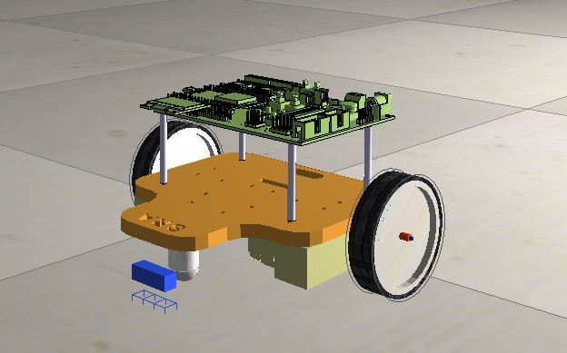
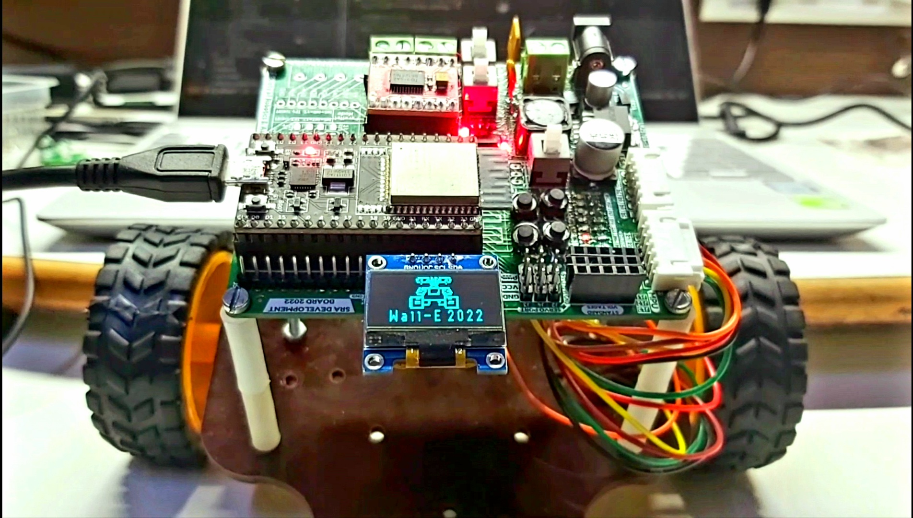
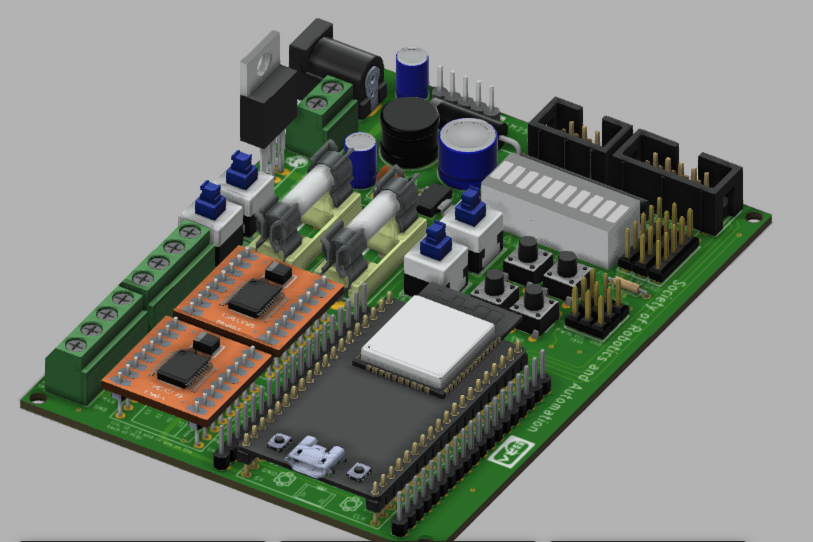

  
  
  <h3 align="center"> Wall-E version 2.3 </h3>
  

    Code repository for <a href="https://github.com/SRA-VJTI/Wall-E">Wall-E_v2.3</a>
     
     
    <a href="https://github.com/SRA-VJTI/Wall-E/issues">Report Bug</a>
    ·
    <a href="https://github.com/SRA-VJTI/Wall-E/issues">Request Feature</a>
    ·
    <a href="https://github.com/SRA-VJTI/Wall-E/pulls">Send a Pull Request</a>
  

 

 
 

  
  
  
  
  

## Table of Contents
- [About the Workshop](#about-the-workshop)
- [Installation](#installation)
- [Examples](#examples)
- [Resources](#resources)
- [Contribution](#contribution)
- [License](#license)

- [Acknowledgements](#acknowledgements)

## About the Workshop

  
  <a href="https://github.com/SRA-VJTI/Wall-E-Sim">
  <h3 align="center"> Wall-E bot simulation </h3>
  </a>

| | |
:-------------------------:|:-------------------------:
 Wall-E Bot Self-Balancing  |  Wall-E Bot with OLED Display 

 

How do you make a robot follow a line? Now what if the robot has only two wheels. How will it balance and follow the line? This is exactly what is taught in the Wall-E workshop.
The Wall-E workshop focuses on the concepts of line-following and self-balancing, using ESP32, a powerful micro-controller with features like inbuilt Wi-Fi support and BLE, with extensive application in several domains like IoT, RF, etc. The workshop entails various essential concepts such as PID Control, Embedded Communication Protocols, PWM, Filters, RTOS, etc. and gives its attendees (first-year students) a general idea about the world of robotics and embedded hardware. Following are some of the highlights:
- The custom-made SRA Development Board & ESP32.
- ESP-IDF, the official IoT Development framework by espressif.
- Motor Control with PWM and PID.
- Accelerometer , gyroscope and complimentary filter.
- Communcation protocols ( UART , SPI , I2C )

## Installation

- For Installation, please refer to [these instructions](Installations.md)
- You can also refer to [Step-by-Step official guide by espressif](https://docs.espressif.com/projects/esp-idf/en/latest/esp32/get-started/#installation-step-by-step)

## Examples

|                  TOPIC                  |                                                        Link                                                         |                                          Description                                           |
| :-------------------------------------: | :-----------------------------------------------------------------------------------------------------------------: | :--------------------------------------------------------------------------------------------: |
|                LED Blink                |              [LED_Blink](https://github.com/SRA-VJTI/Wall-E/blob/dev/1_led_blink/README.md)               |                     Performing LED Blink by connecting the LED with esp32                      |
|           Light Sensing Array           |                    [LSA](https://github.com/SRA-VJTI/Wall-E/blob/dev/2_LSA/README.md)                     |        Sensing Array that uses different Light Sensors, majorly used for Line-Following        |
|                 MPU6050                 |                    [MPU](https://github.com/SRA-VJTI/Wall-E/blob/dev/3_MPU/README.md)                     |           Motion controlled MPU measures angles with respect to 6 Degrees of Freedom           |
| Switch controlled motor in normal mode  |   [Normal_Mode](https://github.com/SRA-VJTI/Wall-E/blob/dev/4_switch_controlled_motor_normal/readme.md)   |         Controls the movement of Bot manually using switches connected in normal mode          |
| Switch controlled motor in parallel mode | [Parallel_Mode](https://github.com/SRA-VJTI/Wall-E/blob/dev/5_switch_controlled_motor_parallel/README.md) |        Controls the movement of bot manually using switches connected in parallel mode         |
|         Pulse Width Modulation          |                    [PWM](https://github.com/SRA-VJTI/Wall-E/blob/dev/6_PWM/README.md)                     |                    Calculate average voltage and controls speed accordingly                    |
|             Line-Following              |              [Line_Following](https://github.com/SRA-VJTI/Wall-E/tree/dev/7_line_following)               |         Line-Following algorithm that enables the bot to follow the path of white line         |
|             Self-Balancing              |         [Self_Balancing](https://github.com/SRA-VJTI/Wall-E/blob/dev/8_self_balancing/README.md)          | Self-Balancing algorithm that enables the bot to balance its weight under the force of gravity |

<!-- ROADMAP -->

## Resources

- Please visit and look at our [Custom-made SRA development board](https://github.com/SRA-VJTI/sra-board-hardware-design)
- Visit ESP-IDF SRA board [Components](https://github.com/SRA-VJTI/sra-board-hardware-design) to have a detailed information about the components of SRA board 

  
  <h3 align="center"> SRA development board </h3>
  

<!-- CONTRIBUTING -->

## Contribution

Contributions are what make the open source community such an amazing place to be learn, inspire, and create. Any contributions you make are **extremely appreciated**.
- See the [open issues](https://github.com/SRA-VJTI/Wall-E/issues) for a list of proposed features (and known issues).

1. Fork the Project
2. Create your Feature Branch (`git checkout -b feature/AmazingFeature`)
3. Commit your Changes (`git commit -m 'Add some AmazingFeature'`)
4. Push to the Branch (`git push origin feature/AmazingFeature`)
5. Open a Pull Request

<!-- LICENSE -->

## License

- Distributed under the [MIT License](https://github.com/SRA-VJTI/Wall-E/blob/master/LICENSE)

<!-- CONTACT -->

[forks-shield]:https://img.shields.io/github/forks/SRA-VJTI/Wall-E
[forks-url]: https://github.com/HarshShah03325/Wall-E/network/members
[stars-shield]: https://img.shields.io/github/stars/SRA-VJTI/Wall-E
[stars-url]: https://github.com/SRA-VJTI/Wall-E/stargazers
[issues-shield]: https://img.shields.io/github/issues/SRA-VJTI/Wall-E
[issues-url]: https://github.com/SRA-VJTI/Wall-E/issues
[license-shield]: https://img.shields.io/github/license/SRA-VJTI/Wall-E
[license-url]: https://github.com/SRA-VJTI/Wall-E/blob/master/LICENSE

